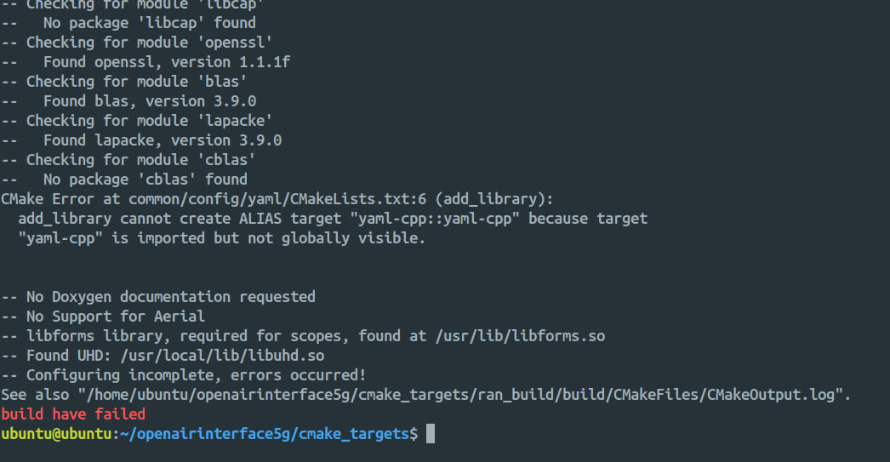

# OAI End-to-End Stack Deployment

This repository provides guidance for deploying an end-to-end OpenAirInterface (OAI) 5G Core (CN5G), gNB, and nrUE stack.

## Deployment Guides

For the official documentation, follow these links:

- [OAI 5G Core Deployment Guide](https://gitlab.eurecom.fr/oai/openairinterface5g/-/blob/develop/doc/NR_SA_Tutorial_OAI_CN5G.md?ref_type=heads)
- [OAI RAN Deployment Guide](https://gitlab.eurecom.fr/oai/openairinterface5g/-/blob/develop/doc/NR_SA_Tutorial_OAI_nrUE.md?ref_type=heads)

Or follow the steps below for a quick setup.

## Hardware Requirements

| Component          | Minimum Specification    |
| ------------------ | ------------------------ |
| OS                 | Ubuntu 22.04 LTS         |
| CPU                | 8 cores x86_64 @ 3.5 GHz |
| RAM                | 32 GB                    |
| Network Interfaces | 2                        |

## OAI CN5G Deployment

### Install Pre-requisites

```bash
sudo apt install -y git net-tools putty unzip
```

#### Install Docker

```bash
sudo apt update
sudo apt install -y ca-certificates curl
sudo install -m 0755 -d /etc/apt/keyrings
sudo curl -fsSL https://download.docker.com/linux/ubuntu/gpg -o /etc/apt/keyrings/docker.asc
sudo chmod a+r /etc/apt/keyrings/docker.asc
echo "deb [arch=$(dpkg --print-architecture) signed-by=/etc/apt/keyrings/docker.asc] https://download.docker.com/linux/ubuntu $(. /etc/os-release && echo "$VERSION_CODENAME") stable" | sudo tee /etc/apt/sources.list.d/docker.list > /dev/null
sudo apt update
sudo apt install -y docker-ce docker-ce-cli containerd.io docker-buildx-plugin docker-compose-plugin
sudo usermod -a -G docker $(whoami)
reboot
```

### Download Configuration Files

```bash
wget -O ~/oai-cn5g.zip https://gitlab.eurecom.fr/oai/openairinterface5g/-/archive/develop/openairinterface5g-develop.zip?path=doc/tutorial_resources/oai-cn5g
unzip ~/oai-cn5g.zip
mv ~/openairinterface5g-develop-doc-tutorial_resources-oai-cn5g/doc/tutorial_resources/oai-cn5g ~/oai-cn5g
rm -r ~/openairinterface5g-develop-doc-tutorial_resources-oai-cn5g ~/oai-cn5g.zip
```

### Pull Docker Images

```bash
cd ~/oai-cn5g
docker compose pull
```

### Start OAI CN5G

```bash
cd ~/oai-cn5g
docker compose up -d
```

### Stop OAI CN5G

```bash
cd ~/oai-cn5g
docker compose down
```

---

## OAI gNB and nrUE Deployment Guide

### Pre-requisites (UHD & Dependencies)

#### Build UHD from source (Ettus USRP)

Or Follow: [UHD Build Guide](https://files.ettus.com/manual/page_build_guide.html)

```bash
sudo apt install -y autoconf automake build-essential ccache cmake cpufrequtils doxygen ethtool g++ git inetutils-tools libboost-all-dev libncurses-dev libusb-1.0-0 libusb-1.0-0-dev libusb-dev python3-dev python3-mako python3-numpy python3-requests python3-scipy python3-setuptools python3-ruamel.yaml libcap-dev libblas-dev liblapacke-dev libatlas-base-dev
git clone https://github.com/EttusResearch/uhd.git ~/uhd
cd ~/uhd
git checkout v4.7.0.0
cd host
mkdir build
cd build
cmake ../
make -j $(nproc)
make test # Optional
sudo make install
sudo ldconfig
sudo uhd_images_downloader
```

#### Install nrscope dependencies

```bash
sudo apt install -y libforms-dev libforms-bin
```

#### Install yaml-cpp

> [!TIP]
> Installing yaml-cpp using `sudo apt install libyaml-cpp-dev` did not resolve the issue mentioned below. Therefore, it is recommended to build and install yaml-cpp directly from its source repository on GitHub. <br> <br>
> 

```bash
cd
git clone https://github.com/jbeder/yaml-cpp.git
cd yaml-cpp
mkdir build && cd build
cmake .. -DYAML_BUILD_SHARED_LIBS=ON
make
sudo make install
cd
rm -r yaml-cpp/
```

### Build OAI gNB and nrUE

#### Clone OAI source code

```bash
git clone https://gitlab.eurecom.fr/oai/openairinterface5g.git ~/openairinterface5g
cd ~/openairinterface5g
# git checkout -f v2.1.0
git checkout develop
```

#### Install OAI dependencies

```bash
cd ~/openairinterface5g/cmake_targets
./build_oai -I
```

#### Build OAI gNB and nrUE

```bash
cd ~/openairinterface5g/cmake_targets
./build_oai -w USRP --ninja --nrUE --gNB --build-lib "nrscope" -C
```

### Run OAI gNB

#### USRP B210

```bash
cd ~/openairinterface5g/cmake_targets/ran_build/build
sudo ./nr-softmodem -O ../../../targets/PROJECTS/GENERIC-NR-5GC/CONF/gnb.sa.band78.fr1.106PRB.usrpb210.conf --gNBs.[0].min_rxtxtime 6 -E --continuous-tx
```

#### USRP N300

```bash
cd ~/openairinterface5g/cmake_targets/ran_build/build
sudo ./nr-softmodem -O ../../../targets/PROJECTS/GENERIC-NR-5GC/CONF/gnb.sa.band77.fr1.273PRB.2x2.usrpn300.conf --gNBs.[0].min_rxtxtime 6 --usrp-tx-thread-config 1
```

#### USRP X300

```bash
cd ~/openairinterface5g/cmake_targets/ran_build/build
sudo ./nr-softmodem -O ../../../targets/PROJECTS/GENERIC-NR-5GC/CONF/gnb.sa.band77.fr1.273PRB.2x2.usrpn300.conf --gNBs.[0].min_rxtxtime 6 --usrp-tx-thread-config 1 -E --continuous-tx
```

#### RFsimulator

```bash
cd ~/openairinterface5g/cmake_targets/ran_build/build
sudo ./nr-softmodem -O ../../../targets/PROJECTS/GENERIC-NR-5GC/CONF/gnb.sa.band78.fr1.106PRB.usrpb210.conf --gNBs.[0].min_rxtxtime 6 --rfsim
```

#### RFsimulator in FR2

```bash
cd ~/openairinterface5g/cmake_targets/ran_build/build
sudo ./nr-softmodem -O ../../../targets/PROJECTS/GENERIC-NR-5GC/CONF/gnb.sa.band257.u3.32prb.usrpx410.conf --rfsim
```

### Run OAI nrUE

#### USRP B210

> [!NOTE]  
> This should be run in a second Ubuntu 22.04 host, other than gNB. <br>
> It only applies when running OAI gNB with USRP B210. <br>

```bash
cd ~/openairinterface5g/cmake_targets/ran_build/build
sudo ./nr-uesoftmodem -r 106 --numerology 1 --band 78 -C 3619200000 --ue-fo-compensation -E --uicc0.imsi 001010000000001
```

#### RFsimulator

> [!NOTE]  
> This should be run on the same host as the OAI gNB. <br>
> It only applies when running OAI gNB with RFsimulator. <br>

```bash
cd ~/openairinterface5g/cmake_targets/ran_build/build
sudo ./nr-uesoftmodem -r 106 --numerology 1 --band 78 -C 3619200000 --uicc0.imsi 001010000000001 --rfsim
```

#### RFsimulator in FR2

> [!NOTE]  
> This should be run on the same host as the OAI gNB
> It only applies when running OAI gNB with RFsimulator in FR2

```bash
cd ~/openairinterface5g/cmake_targets/ran_build/build
sudo ./nr-uesoftmodem -r 32 --numerology 3 --band 257 -C 27533280000 --uicc0.imsi 001010000000001 --ssb 72 --rfsim
```

---

## End-to-End Connectivity Test

Ping test from the UE host to the CN5G

```bash
ping 192.168.70.135 -I oaitun_ue1
```
